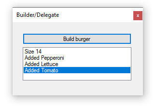

# About

Using a [builder pattern](https://en.wikipedia.org/wiki/Builder_pattern) coupled with a delegate code sample.



```
Imports BuilderPatternExample.Classes

Public Class Form1
    Private Sub BuildButton_Click(sender As Object, e As EventArgs) Handles BuildButton.Click
        ListBox1.Items.Clear()

        Dim burger = (New BurgerBuilder(14))
        AddHandler BurgerBuilder.OnMonitor, AddressOf MonitorBurger

        burger.
            GetSize().
            AddPepperoni().
            AddLettuce().
            AddTomato().
            Build()

    End Sub

    Private Sub MonitorBurger(arg As String)
        ListBox1.Items.Add(arg)
        ListBox1.SelectedIndex = ListBox1.Items.Count - 1
    End Sub
End Class
```

#### See also

https://github.com/karenpayneoregon/FluentPatternVisualBasic