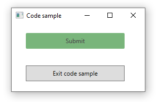

# About 

- Simple example for changing a button color via triggers/styles.
- Using a RoutedCommand rather than working with a button Click event
- See [Triggers](https://docs.microsoft.com/en-us/dotnet/api/system.windows.controls.controltemplate.triggers?view=netcore-3.1) in Application.xaml



```
Class MainWindow
    Public Shared ExitRoutedCommand As New RoutedCommand()
    Public Shared ExitRoutedCommandForKeys As New RoutedCommand()
    Private Sub ExitApplicationCommandOnExecute(sender As Object, e As ExecutedRoutedEventArgs)
        Windows.Application.Current.Shutdown()
    End Sub

    Private Sub ApplicationExitCanExecute(sender As Object, e As CanExecuteRoutedEventArgs)

        Dim target = TryCast(e.Source, Control)

        If target IsNot Nothing Then
            e.CanExecute = True
        Else
            e.CanExecute = False
        End If

    End Sub

    Private Sub Window_Loaded(sender As Object, e As RoutedEventArgs)

        CommandBindings.Add(New CommandBinding(ExitRoutedCommand,
                                               AddressOf ExitApplicationCommandOnExecute,
                                               AddressOf ApplicationExitCanExecute))

        CommandBindings.Add(New CommandBinding(ExitRoutedCommandForKeys,
                                               AddressOf ExitApplicationCommandOnExecute,
                                               AddressOf ApplicationExitCanExecute))

        ExitRoutedCommandForKeys.InputGestures.Add(New KeyGesture(Key.E, ModifierKeys.Control))

    End Sub
End Class
```