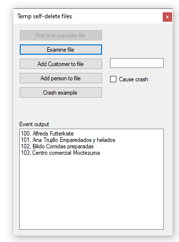

# About

Example to create a file and auto-remove the file on application closed. Uses a delegate to report work being done.

```
Namespace Modules
    Public Module DelegatesModule
        Public Delegate Sub PeekEventHandler(sender As Object, e As PeekArgs)
        Public Delegate Sub CustomersEventHandler(sender As Object, e As CustomerArgs)
    End Module
End Namespace
```

```
Namespace Classes
    Public Class CustomerArgs
        Inherits EventArgs

        Private _customerList As List(Of Customer)

        Public Sub New(customerList As List(Of Customer))
            _customerList = customerList
        End Sub
        Public ReadOnly Property Customers As List(Of Customer)
            Get
                Return _customerList
            End Get
        End Property
    End Class
End NameSpace
```

```
Namespace Classes
    Public Class PeekArgs
        Inherits EventArgs

        Private _message As String

        Public Sub New(message As String)
            _message = message

        End Sub
        Public ReadOnly Property Message As String
            Get
                Return _message
            End Get
        End Property
    End Class
End NameSpace
```
