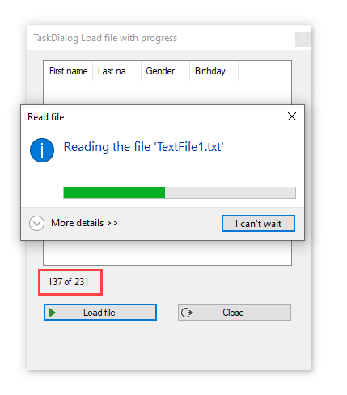

# Introduction

Inevitably when a developer’s task involves reading massive text files questions abound. The first shot may leave the application unresponsive while another attempt creates low memory issues. When this happens usually because of lack of expertise working with massive text files, a novice coders or poor business requirements that the developer does not offer alternatives. Through experience and or due diligence, there are ways to achieve success along when possible challenge business requirements and offer alternative. The following material is intended to provide ideas for alternate methods to work with larger files using Windows Form and by changing the user interface can work for WPF also.

# Requires

Nuget package [Windows-API-Code-Pack-1.1](https://github.com/aybe/Windows-API-Code-Pack-1.1)

> Link goes to GitHub home for the library as there are several releases to consider.

# Original source

My Microsoft TechNet article [VB.NET: Reading large files made simple](https://social.technet.microsoft.com/wiki/contents/articles/53922.vb-net-reading-large-files-made-simple.aspx)

# Unresponsive applications solutions

When working with larger files that does not allow user interaction consider these alternates

When the work is a small portion of the application’s responsibility consider breaking out initial file manipulation into a utility where the code does not change which means the user can still work. 

When breaking out initial file manipulation into a utility the next consideration is to split the file up without performing any other operations such as parsing into a database or list. By monitoring a specific folder, another process parses a smaller file. Splitting the larger file to smaller file at first will be trial and error to get the right size to keep the processes flowing. For instance with a million lines in a file not only will splitting be trial and error for the right size but also how long it takes to split.

Splitting delegated to a Windows Service using a scheduler to look for a file, split the file up during a nightly windows task or a utility, which a user runs manually.

Other considerations when splitting and parsing files is other processes competing for resources on a local machine, network server along with anti-virus services interjecting into the split parse operations.

# Split/chunking larger files

First rule, use asynchronous methods sparingly as they will slow down processing. Second rule, don’t attempt to continually update the user interface when not working with a Windows Service as this will slow down processing. Do math on the operations to update the user interface every ten percent done. Third rule, when working with a user interface always provide a method to cancel the operation without the user clicking the X button on a form which may leave data in a unstable state.

## Basic splitting/chunking

- Decide the location where the large file will reside.
- Decide the location where the smaller files will reside.
- How will splitting be verified against the original file.

# IMPORTANT NOTES

- This code sample simply reads a file into a container but is rather complex with how coding is done with the Windows-API-Pack. To port this code into your project DO NOT simple copy and paste and expect the code to function without fully understanding the various parts of the code from configuring Windows-API-Pack to how the text file is processed.
- There is zero assertion performed to validate if the text file is not malformed, the file is perfect. One might say that never happens, well it does, it depends on the source where the file came from.

